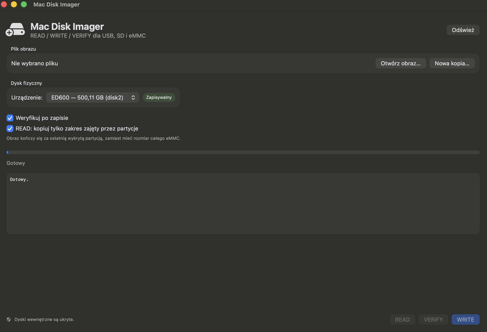

# Mac Disk Imager

[](https://github.com/Radzio442/Mac-Disk-Imager/releases/latest)
[](https://github.com/Radzio442/Mac-Disk-Imager)
[](https://www.swift.org/)
[](LICENSE)

Native macOS disk imaging utility inspired by Win32 Disk Imager.

Read, write and verify full disk images on USB, SD and eMMC devices from a native macOS application.

## Download

### Latest stable release — v1.0.0

**[Download Mac_Disk_Imager_1.0.0.dmg](https://github.com/Radzio442/Mac-Disk-Imager/releases/download/v1.0.0/Mac_Disk_Imager_1.0.0.dmg)**

[View all releases](https://github.com/Radzio442/Mac-Disk-Imager/releases)

**Version:** 1.0.0  
**Platform:** macOS 13 or later  
**Architectures:** Intel `x86_64` + Apple Silicon `arm64`

## Features

- Read a full USB, SD or eMMC device into an image file
- Write an image file to a removable device
- Verify device contents against an image
- Optional verification after writing
- Full-device imaging or imaging up to the end of the last detected partition
- Transfer progress and speed display
- Internal disks hidden from normal device selection
- Automatic unmount/eject handling
- Universal macOS application build
- Privileged helper installation on first use

## Screenshot

Add a screenshot as:

```text
docs/screenshot.png
```

Then it will be shown here:



## Build

Requirements:

- macOS 13+
- Xcode Command Line Tools
- Swift 5.9 or later

Build a universal application and DMG:

```bash
chmod +x build_app.sh create_dmg.sh
./build_app.sh --dmg
```

Output:

```text
dist/Mac Disk Imager.app
dist/Mac_Disk_Imager_1.0.0.dmg
```

To build only for the current host architecture:

```bash
UNIVERSAL=0 ./build_app.sh
```

## Code signing

Without a Developer ID certificate, the build script applies an ad-hoc signature. Gatekeeper may warn when the application is opened on another Mac.

For public distribution, set a valid `Developer ID Application` identity:

```bash
export DEVELOPER_ID_APP='Developer ID Application: YOUR NAME (TEAMID)'
./build_app.sh --dmg
```

## Notarization

Store notarization credentials once:

```bash
xcrun notarytool store-credentials "MacDiskImagerNotary" \
  --apple-id "you@example.com" \
  --team-id "TEAMID" \
  --password "APP-SPECIFIC-PASSWORD"
```

Then build, sign and notarize:

```bash
export DEVELOPER_ID_APP='Developer ID Application: YOUR NAME (TEAMID)'
export NOTARY_PROFILE='MacDiskImagerNotary'
./build_app.sh --dmg
```

The build scripts sign the app and DMG, submit the DMG to Apple, wait for the notarization result, and staple the ticket.

## Privileged helper

On first launch, the application can install its helper at:

```text
/Library/PrivilegedHelperTools/pl.madejak.MacDiskImagerHelper
```

macOS will request administrator authorization.

## Project structure

```text
Mac-Disk-Imager/
├── Package.swift
├── README.md
├── CHANGELOG.md
├── LICENSE
├── .gitignore
├── MyIcon.icns
├── build_app.sh
├── create_dmg.sh
└── Sources/
    ├── MacDiskImager/
    │   ├── MacDiskImagerApp.swift
    │   ├── ContentView.swift
    │   ├── ImagingController.swift
    │   ├── DiskService.swift
    │   ├── DiskDevice.swift
    │   └── Shell.swift
    └── MacDiskImagerHelper/
        └── main.swift
```

## GitHub Releases

Generated `.dmg` files are intentionally excluded from the Git repository.

Release binaries are available here:

https://github.com/Radzio442/Mac-Disk-Imager/releases

Example release workflow:

```bash
gh release create v1.0.0 \
  Mac_Disk_Imager_1.0.0.dmg \
  --title "Mac Disk Imager v1.0.0" \
  --notes "Initial public release of Mac Disk Imager for macOS."
```

## Updating the repository

After making changes:

```bash
git add .
git commit -m "Update Mac Disk Imager"
git push
```

## Safety

**WRITE permanently overwrites the selected device.** Always verify the disk identifier, model and capacity before starting a write operation. Keep backups of important data.

## License

MIT License. See [LICENSE](LICENSE).
